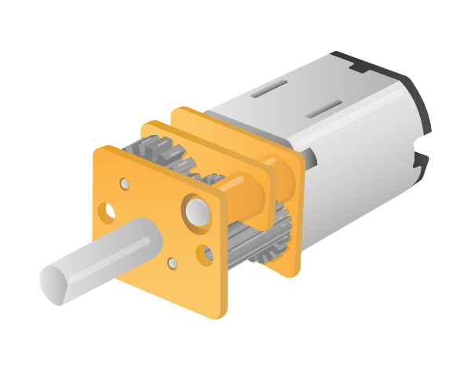
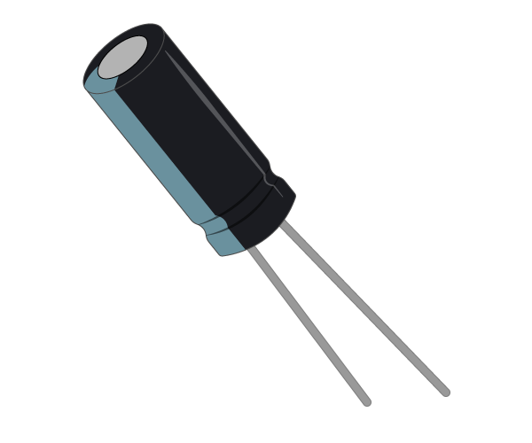

## What you will need

### Hardware

As well as a Raspberry Pi with an SD card and the usual peripherals, you'll also need:

|1x Solderless breadboard | Male-to-female jumper leads | Female-to-female jumper leads | Male-to-male jumper leads |
|:--------:|:-------:|:--------:|:--------:|
|     |  |  |  |

| 1x Tactile button | 3x LEDs | Ultrasonic distance sensor| Passive infrared motion sensor |
|:--------:|:-------:|:--------:|:--------:|
|     |  |  |  |

| Light Dependent Resistor | 2x 5V Micro Metal Gearmotor | 3x 330Ω Resistor| 470Ω Resistor |
|:--------:|:-------:|:--------:|:--------:|
|     |  |  |  |

| 1x 1μF Capacitor | Buzzer | Motor Controller | Battery Pack |
|:--------:|:-------:|:--------:|:--------:|
|     |  |  |  |

### Software

There are no additional software requirements for this resource beyond what is pre-installed in the current Raspbian image. To make sure your SD card is up-to-date, see the [updating Raspbian guide](https://www.raspberrypi.org/documentation/raspbian/updating.md){:target="_blank"}.
